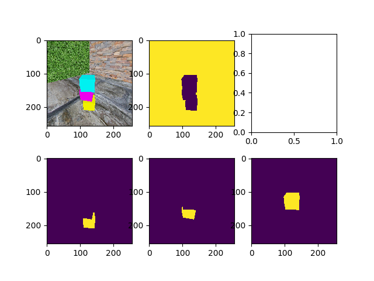

# Cube-Staccing environment



## Installation

Make sure you got Python 3.6+ installed. This may or may not work with older Pythons.

Git-clone this

    git clone https://github.com/fgolemo/cube-stacking.git
    
`cd` into that directory

    cd cube-stacking
    
and install away

    pip install -e .
     
## Usage

### Low-level access: `CubeStacking` class

You can start a simulation, either with debugger attached (slow) or without ("headless"):

```python
from cube_stacking.sim import CubeStacking

sim = CubeStacking(headless=False)
```

And then you can add blocks to your heart's content:

```python
for i in range(15):
  sim.place_cube([0, 0])
```

...where `[0, 0]` corresponds to the X and Y coordinate of the block and the default arena size is 8x8 (can be changed in the constructor of the `CubeStacking` class) and the default block size is 1x1.

To get an image, call the render function with optional segmentation map:

```python
img, segmap = sim.render(segmap=True)
```

To check if the block tower has fallen from the last cube:

```python
tower_fell = sim.last_cube_fell(steps=50)
```

...were `steps=50` is the number of simulation steps that should be carried out to verify.

### High level access (gym environments):

replace 
- `{randomness}` with either `NonRandom`, `Uniform01`, `Uniform05`, or `Normal05` to make cubes placement either non-random or random in a given radius
- `{headlessness}` with either `Graphical` for an easy way to debug the environment or `Headless` to allow for faster runtime

#### Single-Player (against heuristic):

Environments:
- `Cubestacc-SinglePlayer-Heuristic-ArenaFour-{randomness}-{headlessness}-v0` for a 4x4 arena in which the action space 2x[-1,1] corresponds to the [-4,4]x[-4,4] arena and placement is absolut with respect to the arena
- `Cubestacc-SinglePlayer-Heuristic-RelativeAct-{randomness}-{headlessness}-v0` for a 4x4 arena in which the action space 2x[-1,1] corresponds to the placement with respect to the reference block that is placed at the beginning of each episode

#### Two-Player (against other policies in a directory):

- `Cubestacc-TwoPlayer-Full-{randomness}-PPO-{headlessness}-v2` for playing against other policies that are stored in `cube_stacking/self_play_policies` (the algorithm will occasionally check if there are new policies in that directory) with an absolute action space 2x[-1,1]

(There are also other environments with weighted blocks, with background textures, and with other maximum-heights that I don't have time to write up right now. If you want to learn more about them, check out the code in `cube_stacking/envs/` or drop a Github issue with your question.)

### How to train the 2-player policies:

Use my modifies PPO:

https://github.com/fgolemo/pytorch-a2c-ppo-acktr-gail

Here's an example set of hyperparameters that works for me to train self-play policies (each policy learns to play against 20 random past policies of itself):

**IMPORTANT:** The current CubeStacc implementation is not thread-safe, i.e. you can NOT run multiple instances at the same time in threads. However, running multiple processes or running a single instance in multiple shells is fine. 

```bash
python main.py 
    --custom-gym 'gibson_transfer' 
    --env-name 'Gibson-TwoPlayer-Full-NonRandom-PPO-Headless-v2' 
    --algo ppo 
    --use-gae 
    --log-interval 1 
    --num-steps 2048 
    --num-processes 1 
    --lr 3e-4 
    --entropy-coef 0 
    --value-loss-coef 0.5 
    --ppo-epoch 10 
    --num-mini-batch 32 
    --gamma 0.99 
    --gae-lambda 0.95 
    --frame-stacc 1 
    --num-env-steps 3000000 
    --use-linear-lr-decay 
    --save-interval 10 
    --seed 1234
```
